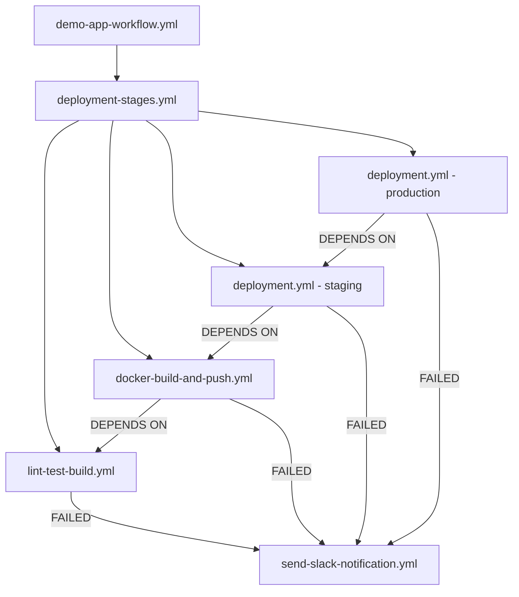

## What you'll find in this repository

1. **.github-workflows** - all the deployment files
2. **demo-app** - contains a very rudimentary java application that listens to port 8080, exposes a health check and a home page
3. **Dockerfile** - configures the docker image for the java application
4. **deployment.yml** - configures the deployment and the service kuberenetes objects

## Deployment process

### 1. Overview

You'll find below a diagram that describes how the deployment process is structured:

### 2. Description

**demo-app-workflow.yml** - sets the application specific information that we need for the deployment

**deployment-stages.yml** - outlines the pipeline jobs that need to run, from linting, testing and building, all the way to the deployment in multiple environments

**docker-build-and-push.yml** - builds the docker image and pushes it to a remote repository

**deployment.yml** - creates a minikube environment that's simulating the ECS environment, deploys the `demo-app` to the cluster and runs a health check

**send-slack-notification.yml** - in the case where any of the jobs above fail, it is triggered and notifies a Slack channel

### 3. Why this structure?

Assuming that we'll be building more than one service and that we'll want to deploy it using a pipeline, this setup helps with:

- reusability - aside from the `demo-app-workflow.yml` which is specific to the `demo-app`, we can reuse all the other workflow files in different contexts
- readability - breaking down the jobs in multiple templates helps with reading the code with more ease, which proves to be useful for newbies or in critical scenarios.

### 4. What's in that alert?

For the alert there is a lot of room for improvement. I've added it just as a demo to showcase the things that I find important in a notification.

